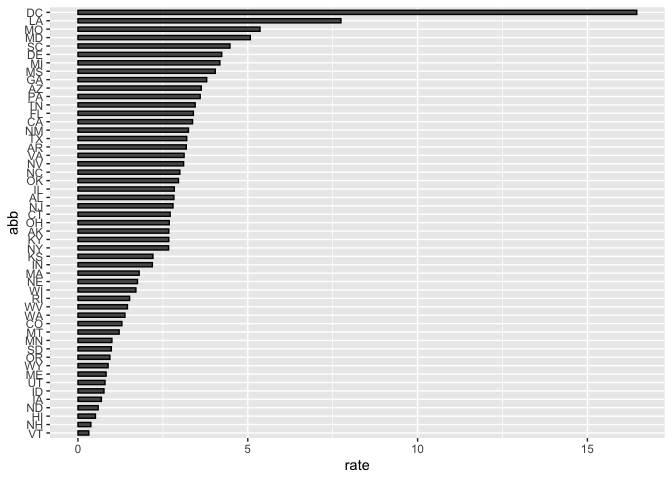

# Report: omicidi con arma da fuoco (Gun Murders)
Stefano Calza

## Introduzione

Questo è un report sui tassi di omicidi con armi da fuoco del 2010,
ottenuto dai rapporti dell’FBI. I dati originali sono stati ottenuti da
[this Wikipedia
page](https://en.wikipedia.org/wiki/Murder_in_the_United_States_by_state).

Utilizziamo la seguente library:

``` r
library(tidyverse)
```

e carichiamo i dati già ripuliti e trasformati (*wrangled*):

``` r
load("rdas/murders.rda")
```

## Tasso di omicidi per stato

Notiamo l’ampia variabilità da stato a stato generando un grafico a
barre che mostra il tasso di omicidi per stato:


